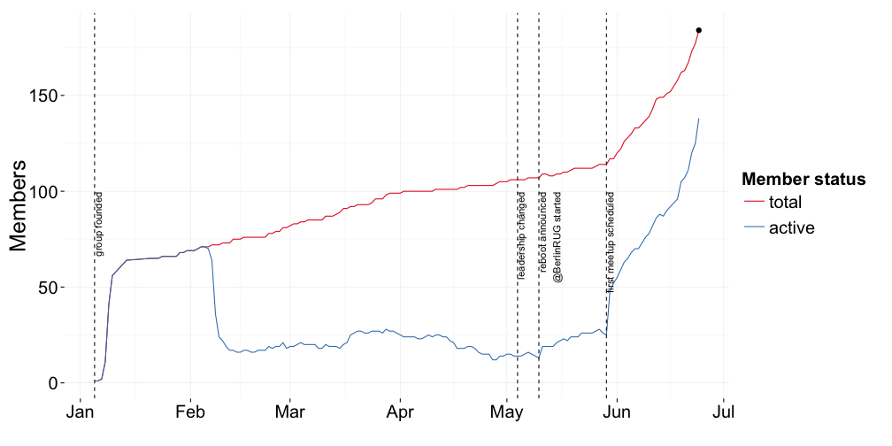

## Schedule for today

Time|What's happening
-------|-------
19:00|doors open
19:30|Konstantin Greger ([@kogreger](https://twitter.com/kogreger)): "Welcome address and brief group introduction"
~19:45|Berry Boessenkool (Universität Potsdam, [@berryboessenkoo](https://twitter.com/berryboessenkoo)): "Why you need an umbrella on hot days - R application in hydrometeorological data analysis""
~20:15|Daniel Kirsch ([@kirel](https://twitter.com/kirel)): "Analyzing children's relay times for fun and... gold medals""
afterwards|socializing & networking
22:00|doors close

--- .class #id &twocol

## Our group sponsors

*** =left

 

*** =right

 

--- .class #id 

## Number of group members

 

--- .class #id 

## Ratio of meetup attendance registration

 

--- .class #id

## Survey - I'd go to a group meeting

 

--- .class #id

## Survey - I would present something myself one day

 

--- .class #id

## Survey - I'd like to have the talks at the meetings be recorded

 

--- .class #id

## Survey - I'd like to have the talks at the meetings be live streamed

 

--- .class #id

## Survey - Group meetings would work best for me on ...

 

--- .class #id

## Survey - Group meeting should start ...

 

--- .class #id

## Survey - Group meetings should be ...

 

--- .class #id

## Survey - Group meetings would be most interesting for me if ...

 

--- .class #id

## Survey - My field of work/research

 

--- .class #id

## Survey - I'm ...

 

--- .class #id

## Survey - I'm using R ...

 

--- .class #id 

## Survey - My R proficiency level

 

--- .class #id

## Survey - My gender

 

--- .class #id

## Survey - My age

 

--- .class #id

## Survey - My highest degree

 

--- .class #id

## Survey - My english proficiency

 

--- .class #id

## Survey - My other language skills

 

--- .class #id

## Survey - I have been living in Berlin ...

 

--- .class #id

## You are the group - the group is you!
##### (image credit: [Peter O'Connor aka anemoneprojectors on Flickr](https://flic.kr/p/9GEQsk))

 

--- .class #id 

## Start
##### (image credit: [Dirk Vorderstraße on Flickr](https://flic.kr/p/h8fWVM))

 

--- .class #id 

## Contact

* Group website on Meetup.com: [http://www.meetup.com/Berlin-R-Users-Group/](http://www.meetup.com/Berlin-R-Users-Group/)
* Twitter: [@BerlinRUG](https://twitter.com/berlinrug)
* Konstantin: [@kogreger](https://twitter.com/kogreger) or [kogreger@gmail.com](mailto:kogreger@gmail.com)

--- .class #id 

## Schedule for today

Time|What's happening
-------|-------
19:00|doors open
19:30|Konstantin Greger ([@kogreger](https://twitter.com/kogreger)): "Welcome address and brief group introduction"
~19:45|Berry Boessenkool (Universität Potsdam, [@berryboessenkoo](https://twitter.com/berryboessenkoo)): "Why you need an umbrella on hot days - R application in hydrometeorological data analysis""
~20:15|Daniel Kirsch ([@kirel](https://twitter.com/kirel)): "Analyzing children's relay times for fun and... gold medals""
afterwards|socializing & networking
22:00|doors close
